# Customer Complaint Intelligence Platform

An end-to-end analytics and NLP platform built on the CFPB Consumer Complaint
dataset (15.95M complaints, 8-9 GB raw CSV). The platform turns raw complaint
records into an executive dashboard covering risk scoring, growth detection,
forecasting, NLP-based complaint classification, and prescriptive
recommendations.

This is a portfolio / personal project. It is built with production-style
engineering practices (config-driven design, defensive error handling,
modular pipeline, containerized deployment) but has not been deployed to a
real organization or real users.

---

## Quick Snapshot

| | |
|---|---|
| Dataset | 15.95M complaints, 7.97K companies, 21 products |
| Product classifier accuracy | 75.28% |
| Issue classifier accuracy | 62.39% |
| Forecast validation MAPE | 3.57% |
| Unit tests | 14/14 passing |
| Deployment | Dockerized, published to Docker Hub |

Full metrics, how they were measured, and their limitations: [`evaluation.md`](evaluation.md).

---

## Dashboard Preview

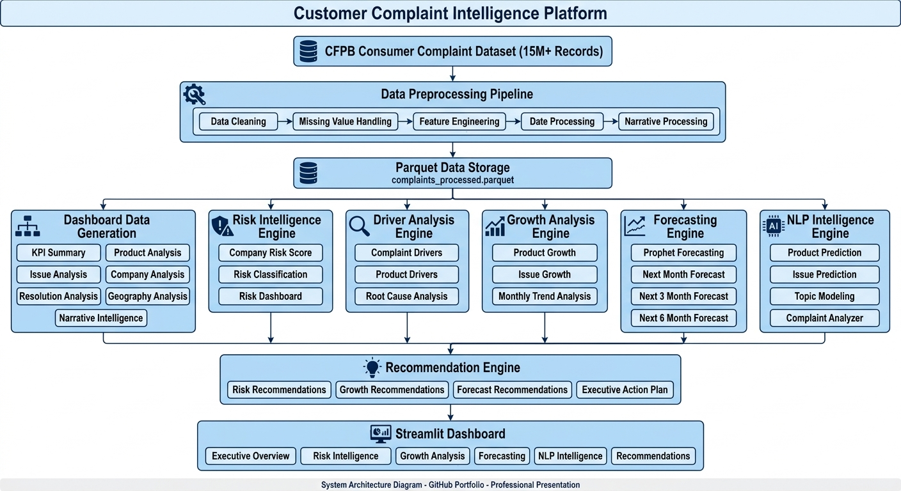

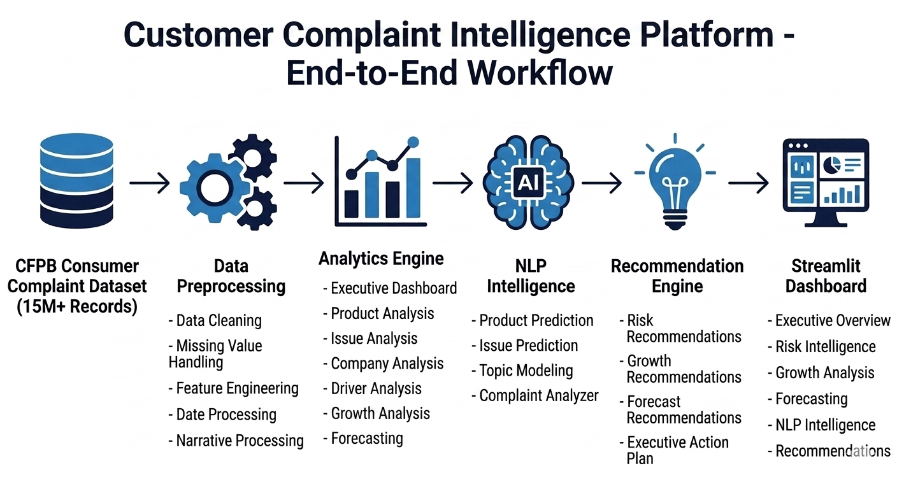

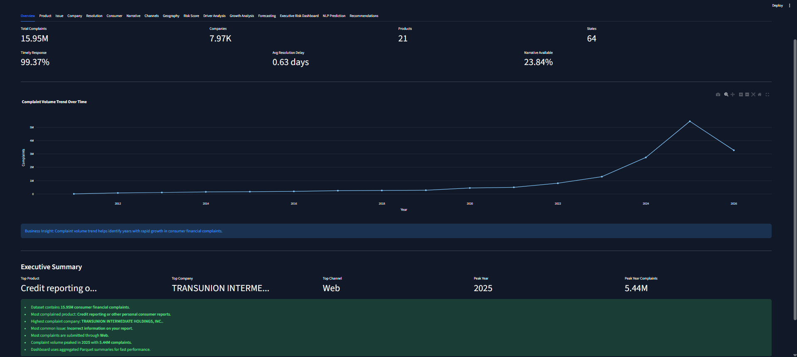

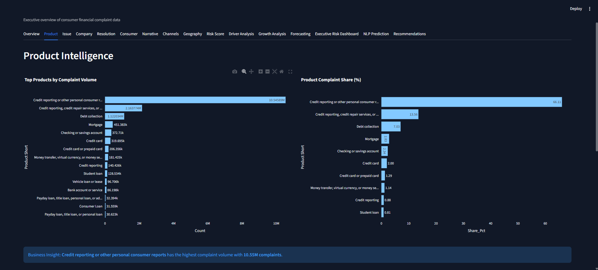

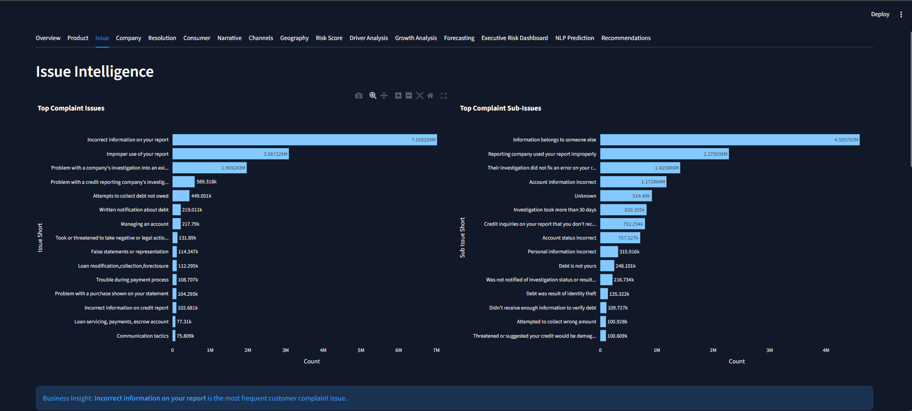

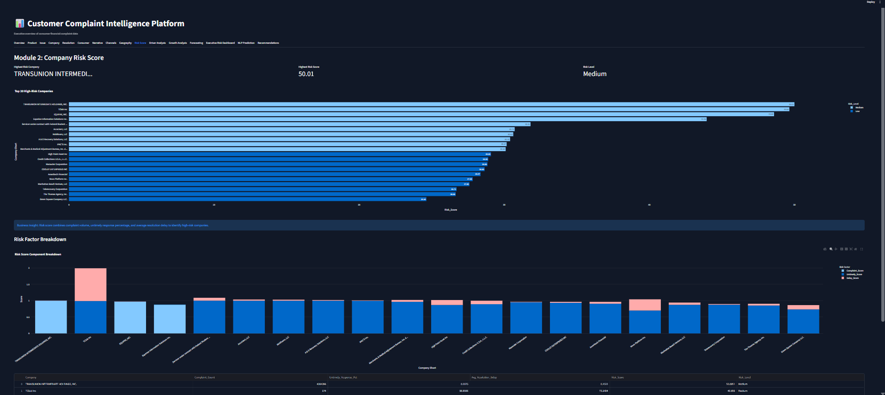

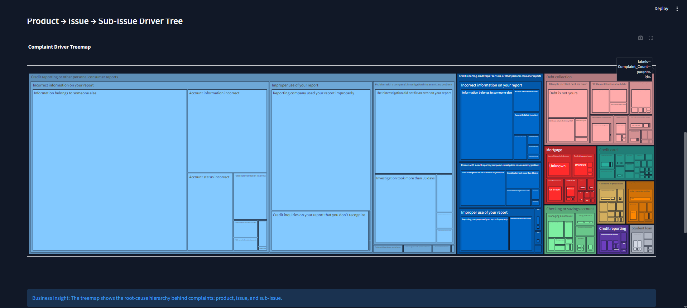


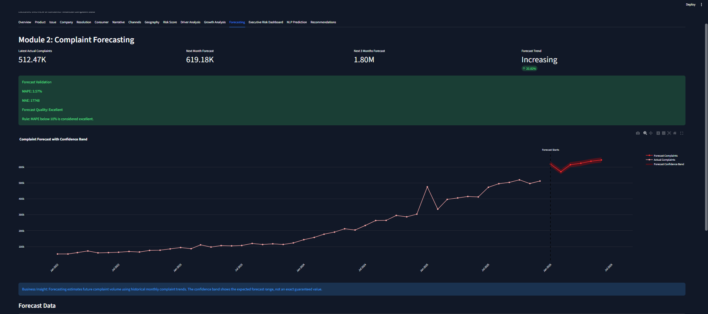


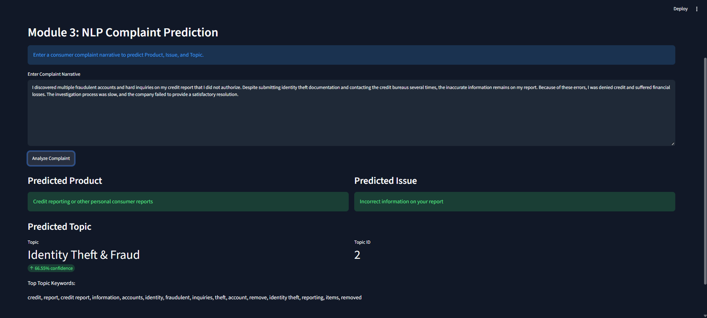


### Docker Deployment

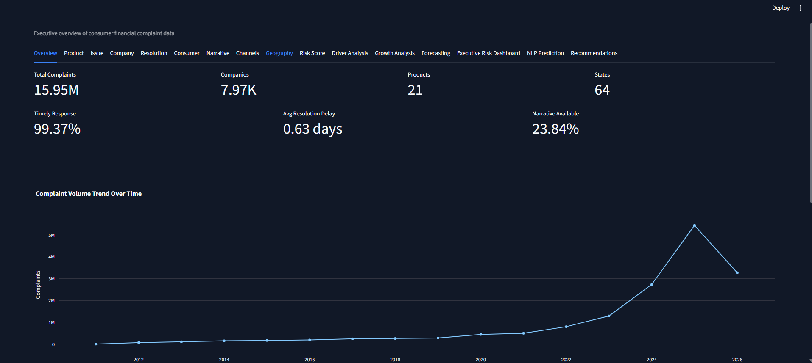

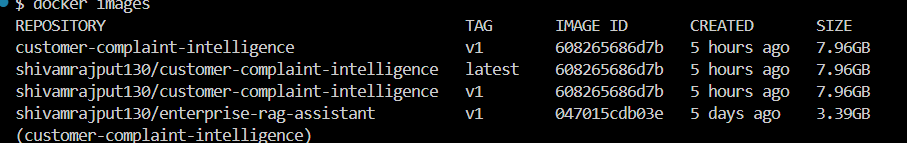

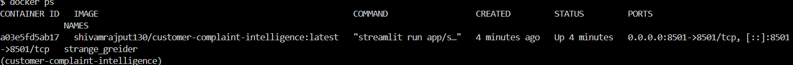

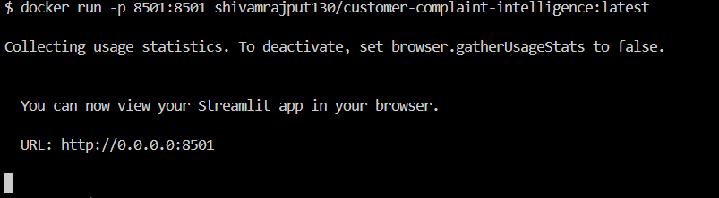


---

## Problem Statement

15.95M consumer complaints are too large for manual or notebook-based
analysis, and raw exploration repeatedly hits memory limits on a single
machine. At the same time, a pile of charts is not useful to a decision
maker on its own — someone still has to translate "Issue X grew 40% this
year" into "do something about it."

This project addresses both problems:

1. **Scale** — process 15.95M rows and ~3.8M free-text narratives on
   consumer-grade hardware (no GPU, limited RAM) using chunked processing,
   Parquet storage, and pre-aggregated dashboard summaries.
2. **Actionability** — go beyond descriptive charts. Risk scores, growth
   signals, forecasts, and complaint drivers feed into a recommendation
   engine that outputs a prioritized executive action plan.

---

## Dataset

| Property | Value |
|---|---|
| Source | CFPB Consumer Complaint Database |
| Total complaints | 15.95M |
| Raw CSV size | 8-9 GB |
| Complaints with narrative text | ~3.8M (23.84%) |
| Companies | 7.97K |
| Products | 21 |
| States / territories | 64 |

---

## What It Does

### Module 1 — Executive & EDA Dashboard
Product, Issue, Company, Resolution, Geography, Consumer Segment, and
Narrative intelligence — built from pre-aggregated Parquet summaries so the
dashboard never reads the full 15.95M-row dataset at runtime.

### Module 2 — Risk Intelligence
- **Company Risk Score**: weighted combination of complaint volume,
  untimely-response rate, and average resolution delay, with a minimum
  complaint-count floor so low-volume companies can't land in "High Risk"
  from a statistically noisy small sample.
- **Driver Analysis**: Product → Issue → Sub-issue root-cause breakdown.
- **Growth Analysis**: year-over-year growth per product/issue, with a
  dedicated "New / Emerging" label for items that had zero complaints in
  the prior year (instead of being misleadingly labeled "Stable").
- **Forecasting**: Prophet-based monthly complaint volume forecast with a
  held-out validation window (MAE / MAPE), not just a point forecast.

### Module 3 — NLP Intelligence
- TF-IDF + tuned Logistic Regression classifiers for **Product** and
  **Issue** prediction from free-text complaint narratives.
- LDA topic modeling over cleaned narrative text, with manually labeled
  topic names.
- An interactive complaint analyzer in the dashboard: paste a complaint,
  get predicted product, issue, and topic.

### Module 4 — Recommendation Engine
Converts the diagnostic signals from Modules 1-3 (risk scores, growth
labels, forecast trend, complaint drivers) into:
- A prioritized **Executive Action Plan** (top action per focus area).
- A filterable list of individual recommendations with priority levels.

---

## Key Results

| Metric | Value |
|---|---|
| Timely response rate | 99.37% |
| Average resolution delay | 0.63 days |
| Narrative availability | 23.84% |
| Forecast validation MAPE | 3.57% |
| Forecast validation MAE | 17,748 |
| Product classifier accuracy | 75.28% |
| Issue classifier accuracy | 62.39% |
| Unit tests passing | 14/14 |

See [`evaluation.md`](evaluation.md) for how these numbers were measured and
what their limitations are.

---

## Architecture

```
CFPB Raw Data (15.95M rows, 8-9GB CSV)
        ↓
Preprocessing & Validation (chunked, Parquet output)
        ↓
Dashboard Aggregation (small, pre-computed Parquet summaries)
        ↓
   ┌────────────┬─────────────┬──────────────┐
   ↓            ↓             ↓              ↓
Risk Scoring  Growth      Driver        Forecasting
   │          Analysis    Analysis      (Prophet)
   └────────────┴─────────────┴──────────────┘
                     ↓
          Recommendation Engine
                     ↓
          Streamlit Dashboard (reads summaries only)
                     ↓
          Docker Deployment
```

NLP training (`create_narrative_training_data.py`, `nlp_model_training.py`,
`nlp_tuning.py`) runs as a **separate, occasional** process — not part of
the main analytics pipeline — because retraining on millions of narratives
is expensive and shouldn't happen on every dashboard refresh. See
[`runbook.md`](runbook.md) for exact commands.

Full diagram and module-by-module breakdown: [`architecture.md`](architecture.md).

---

## Engineering Decisions

| Decision | Reasoning |
|---|---|
| Parquet over CSV for all intermediate storage | Columnar format, ~85% smaller on disk (9GB → ~1.3GB), supports column pruning so downstream modules only read the columns they need |
| Pre-aggregated dashboard summaries | Streamlit reads small summary Parquet files (KPIs, growth tables, risk scores) instead of the full 15.95M-row dataset on every page load |
| TF-IDF + Logistic Regression over Transformers | On ~3.8M narratives, a tuned Logistic Regression gives a strong accuracy/cost trade-off with low memory and fast CPU-only inference — see [Why Not Deep Learning?](#why-not-deep-learning) |
| No sentiment analysis | Complaint narratives are structurally negative by definition (people only write a narrative when something went wrong) — generic sentiment scoring would not add decision-useful information |
| Config-driven design (`config.yaml`) | Risk thresholds, growth thresholds, forecast settings, and NLP parameters are externalized so behavior can change without touching code |
| NLP training kept separate from the main pipeline | Retraining on millions of narratives is computationally expensive and shouldn't block a routine dashboard data refresh |
| Custom exception class + structured logging | Every pipeline stage logs to console + rotating file handler, and failures carry file/line context for debugging |

### Why Not Deep Learning?

The project prioritizes scalability, reproducibility, and CPU-only
deployment over the marginal accuracy gains a transformer model might offer.
On ~3.8M narratives, a tuned TF-IDF + Logistic Regression pipeline achieved
75.28% product accuracy and 62.39% issue accuracy while keeping training
time, memory footprint, and Docker image size manageable on a single
machine with no GPU. A transformer-based approach was considered and
rejected for this iteration — see [`case_study.md`](case_study.md#rejected-approaches)
for the full reasoning.

---

## Project Structure

```
customer-complaint-intelligence/
├── app/
│   └── streamlit_app.py
├── src/
│   ├── config_loader.py
│   ├── logger.py
│   ├── exception.py
│   ├── preprocessing.py
│   ├── dashboard_data.py
│   ├── risk_analysis.py
│   ├── driver_analysis.py
│   ├── growth_analysis.py
│   ├── forecasting.py
│   ├── recommendation_engine.py
│   ├── create_narrative_training_data.py
│   ├── nlp_model_training.py
│   ├── nlp_tuning.py
│   ├── nlp_predictor.py
│   └── pipeline.py
├── data/
│   ├── raw/                  (excluded from Docker image and git)
│   └── processed/
│       └── dashboard/
├── models/
│   └── nlp/
├── tests/
├── assets/
├── .streamlit/
│   └── config.toml
├── config.yaml
├── requirements.txt
├── Dockerfile
├── docker-compose.yaml
├── CHANGELOG.md
└── LICENSE
```

---

## Setup & Usage

### 1. Environment

```bash
python -m venv venv
source venv/bin/activate        # Windows: venv\Scripts\activate
pip install -r requirements.txt
```

### 2. Place Raw Data

Download the CFPB Consumer Complaint dataset and place it at the path
configured in `config.yaml` (`paths.raw_data_path`, default
`data/raw/complaints.csv`).

### 3. Run the Pipeline

```bash
python -m src.preprocessing
python -m src.pipeline
```

`pipeline.py` runs dashboard aggregation, risk scoring, driver analysis,
growth analysis, forecasting, and the recommendation engine, in that order.
It does **not** train or retrain NLP models — see [`runbook.md`](runbook.md)
for that separate step.

### 4. Launch the Dashboard

```bash
streamlit run app/streamlit_app.py
```

### 5. Run Tests

```bash
pytest
```

### 6. Docker

```bash
docker build -t customer-complaint-intelligence:v1 .
docker run -p 8501:8501 customer-complaint-intelligence:v1
```

Pre-built image (Docker Hub):
[hub.docker.com/repository/docker/shivamrajput130/customer-complaint-intelligence](https://hub.docker.com/repository/docker/shivamrajput130/customer-complaint-intelligence)

```bash
docker pull shivamrajput130/customer-complaint-intelligence:latest
docker run -p 8501:8501 shivamrajput130/customer-complaint-intelligence:latest
```

Full Docker instructions: [`docker.md`](docker.md).

---

## Configuration-Driven Design

All thresholds, paths, forecasting settings, risk-score weights, and NLP
parameters are controlled through `config.yaml` rather than being
hardcoded. This means risk thresholds or forecast horizons can be tuned
without touching pipeline code. Key settings (risk thresholds, growth
labels, forecast parameters, NLP sample sizes) are referenced throughout
this README and in [`adr.md`](adr.md) (ADR-006) — a dedicated
`config_reference.md` enumerating every key is on the documentation
to-do list but doesn't exist yet.

---

## Reproducibility

- All sampling and train/test splits use a fixed `random_state` (42 by
  default, configurable via `config.yaml`).
- The NLP hyperparameter search space (`nlp_tuning.py`) is a fixed, small
  grid rather than an open-ended search, so results are repeatable and
  bounded in runtime.
- Forecast validation uses a fixed 6-month holdout window rather than
  random splits, since complaint volume is a time series.

---

## Known Limitations

- **Geographic analysis is not per-capita.** State-level complaint counts
  are raw totals, not normalized by state population — larger states will
  always rank higher by volume even if their per-resident complaint rate
  is lower.
- **NLP predictions return only the top label.** Product/Issue predictions
  do not currently expose a confidence score or top-3 alternatives, unlike
  the topic model, which does expose a confidence score.
- **Topic modeling uses LDA, not transformer embeddings.** Topic names are
  manually assigned based on top keywords per topic, not learned end-to-end.
- **Forecasting uses complaint volume only.** It does not incorporate
  external signals (e.g. regulatory changes, economic indicators) that
  could affect complaint volume.
- **NLP confidence scores are not calibrated probabilities.** The topic
  model's confidence value comes directly from LDA's `transform()` output
  and has not been calibrated against true outcome frequencies.
- **`nlp_model_training.py` is not yet migrated to `config.yaml`.** It is
  the one module that still uses hardcoded constants instead of reading
  from config, unlike every other pipeline module.

The Known Limitations list above and the per-module weaknesses in
[`evaluation.md`](evaluation.md) cover the known risks at this time. A
dedicated `risk_register.md` with formal impact/mitigation tracking is
not maintained for this project — that level of process overhead isn't
warranted for a project at this stage.

---

## Documentation Index

| File | Contents |
|---|---|
| [`architecture.md`](architecture.md) | Full pipeline architecture, module dependency flow |
| [`evaluation.md`](evaluation.md) | Model metrics, how they were measured, and their limitations |
| [`case_study.md`](case_study.md) | Engineering challenges, tradeoffs, and rejected approaches |
| [`docker.md`](docker.md) | Docker build, run, and deployment instructions |
| [`data_dictionary.md`](data_dictionary.md) | Column-by-column description of the dataset |
| [`runbook.md`](runbook.md) | Step-by-step operational commands |
| [`benchmark.md`](benchmark.md) | Measured (and explicitly not-yet-measured) performance numbers |
| [`adr.md`](adr.md) | Architecture Decision Records — key technical decisions and why |
| [`CHANGELOG.md`](CHANGELOG.md) | Version history |
| [`LICENSE`](LICENSE) | MIT License |

---

## License

MIT License — see [`LICENSE`](LICENSE).